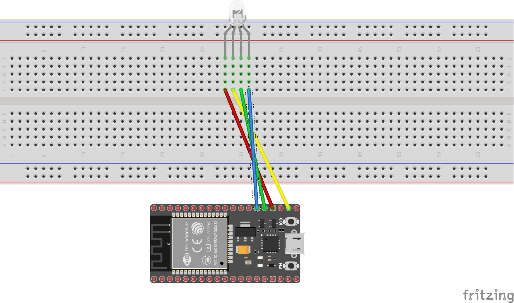

# Led-Multicolor-IoT


Led Multicolor IoT 

Ce projet à été réalisé par [@siham](https://github.com/siham87) et [@luisribeiro1995](https://github.com/LuisRibeiro1995)

## Video :
[](https://www.youtube.com/watch?v=_VJEbB0QMjM)


## **Bibliothéque utilisée**
+ esp32 : [https://github.com/adafruit/Adafruit_MQTT_Library)
+ Wifi : [https://www.arduino.cc/en/Reference/WiFi)

## **Matériel**
+ esp32
+ Led Multicolor


## **Montage**



## **Code**

```
#include <analogWrite.h>
#include <WiFi.h>
#include <Adafruit_MQTT_Client.h>
#include <Adafruit_MQTT.h>
WiFiClient wiFiClient;
Adafruit_MQTT_Client mqttClient(&wiFiClient, "192.168.1.107", 1883);
Adafruit_MQTT_Subscribe redSubscriber(&mqttClient, "/red");
Adafruit_MQTT_Subscribe greenSubscriber(&mqttClient, "/green");
Adafruit_MQTT_Subscribe blueSubscriber(&mqttClient, "/blue");
    
void redCallback(double x) {
  Serial.println(x);
  analogWrite(12, x);
}
void greenCallback(double x) {
  Serial.println(x);
  analogWrite(14, x);
}
void blueCallback(double x) {
  Serial.println(x);
  analogWrite(27, x);
}
void setup() {
  Serial.begin(115200);
  WiFi.begin("createch", "createch");
  delay(5000);
  Serial.print("IP address: ");
  Serial.println(WiFi.localIP());
  redSubscriber.setCallback(redCallback);
  mqttClient.subscribe(&redSubscriber);
  greenSubscriber.setCallback(greenCallback);
  mqttClient.subscribe(&greenSubscriber);
  blueSubscriber.setCallback(blueCallback);
  mqttClient.subscribe(&blueSubscriber);
 
}
void loop() {
  if (mqttClient.connected()) {
    mqttClient.processPackets(10000);
    mqttClient.ping();
  } else {
    mqttClient.disconnect();
    mqttClient.connect();
  }
  
}
```


